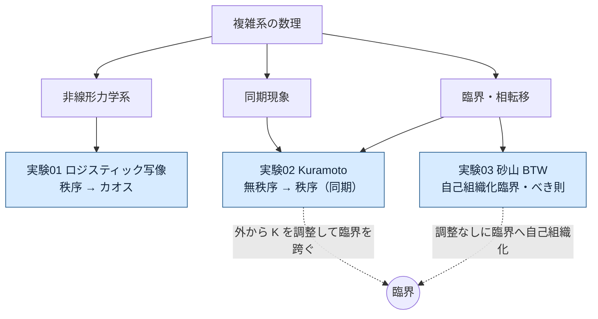

# 実験ダッシュボード

このリポジトリの実験を一望するための対応表と概念図。「何を・どんな条件で実験し・
何が分かったか」をここで把握し、詳細は各実験ディレクトリへ。

> このファイルは手動メンテ。新しい実験を足したら下の表・図・パラメータ欄を更新する。

## 概念マップ

## 実験一覧（対応表）

| # | 問い | モデル / 式 | 主役の結果 | 鍵概念 | スタック |
|---|------|-------------|-----------|--------|----------|
| 01 | 単純な式からカオスは生まれるか | $x_{n+1}=r\,x_n(1-x_n)$ | 周期倍分岐 → カオス、$\delta\approx4.67$ | 分岐・カオス・初期値鋭敏性・普遍性 | [Jupyter](experiments/01_logistic_map/) |
| 02 | バラバラの振動子はいつ同期するか | $\dot\theta_i=\omega_i+\frac{K}{N}\sum_j\sin(\theta_j-\theta_i)$ | $K_c\approx1.60$ で同期の相転移 | 秩序変数・平均場・二次相転移 | [marimo](experiments/02_kuramoto/) |
| 03 | なぜ自然界はべき則だらけか | BTW 砂山（$z_c=4$, 開放境界） | 臨界へ自己組織化、$P(s)\sim s^{-\tau},\ \tau\approx1.1$ | SOC・べき則・時間スケール分離 | [Jupyter](experiments/03_sandpile/) |

## パラメータ条件（数値設定）

| # | 主要パラメータ | 値・範囲 | 測定量 | シード |
|---|----------------|----------|--------|--------|
| 01 | 制御パラメータ $r$ | $[2.5, 4.0]$（分岐図）, 代表値 2.8/3.2/3.5/3.9 | 軌道, 分岐図, Lyapunov 指数 $\lambda(r)$, Feigenbaum $\delta$ | 初期値 $x_0=0.5$ |
| 02 | 結合 $K$ / 振動子数 $N$ / ばらつき $\sigma$ | $K\in[0,4]$, $N=400\text{–}500$, $\sigma=1$, $dt=0.05$, $T=40$ | 秩序変数 $r(t)$, 定常 $r_\infty(K)$, 位相配置 | 0, 1 |
| 03 | 格子 $L$ / 閾値 $z_c$ / 駆動回数 | $L=64$(統計)/80(GIF), $z_c=4$, 約 12 万駆動 | 雪崩サイズ・継続時間・広がりの分布, 平均高さ | 0 |

## 結果サマリ（一言ずつ）

- **01**: 1 次元・1 パラメータの決定論的写像でも周期倍分岐を経てカオスに至る。分岐の縮み率
  $\delta\approx4.669$ は写像によらない普遍定数（ミクロに依らないマクロ法則の最初の例）。
- **02**: 結合 $K$ を上げると臨界値 $K_c=\sigma\sqrt{8/\pi}\approx1.60$ で秩序変数 $r$ が自発的に
  立ち上がる二次相転移。シミュレーションが理論値とよく一致。
- **03**: 砂を落とすだけで系は平均高さ $\approx2.12$ の臨界へ自己組織化し、雪崩サイズが
  数桁にわたるべき分布に。金融のファットテール（市場 SOC 仮説）と通底。

## 横断テーマ

- **臨界の二つの現れ方**: 外部調整で跨ぐ（02）vs 調整なしに自己組織化（03）。
- **普遍性**: ミクロの詳細に依らないマクロ法則（01 の $\delta$、臨界指数）。
- **秩序とカオスの両輪**: 秩序→カオス（01）と 無秩序→秩序（02, 03）。
