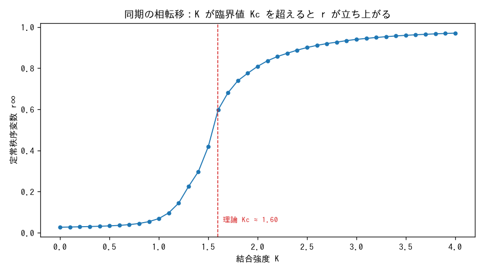
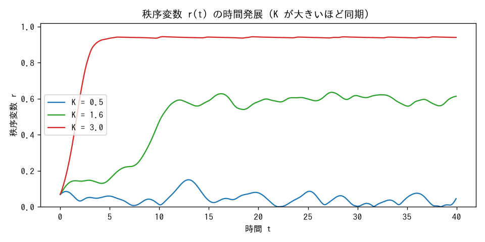
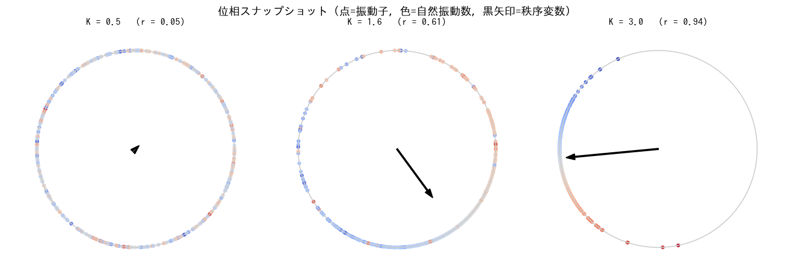

# 実験 02: Kuramoto 結合振動子 — 同期の相転移

**分野**: 同期現象 / 自己組織化 / **スタック**: marimo（対話的）

$$\dot\theta_i = \omega_i + \frac{K}{N}\sum_j \sin(\theta_j-\theta_i)$$

バラバラのテンポを持つ多数の振動子が、結合強度 $K$ を上げると**ある臨界値 $K_c$ を境に
突然そろい始める**（同期の相転移）。実験01（少数自由度のカオス）と対をなす、
**多自由度の自己組織化**の最小モデル。理論的背景は
[`../../notes/synchronization.md`](../../notes/synchronization.md) を参照。

## なぜ marimo か

この実験の主役は「$K$ を動かしたときの挙動の変化」。marimo の**リアクティブ性**
（スライダーを動かすと依存セルだけが自動再実行）が、相転移を体感的に探るのに最適。
実験01（Jupyter・計算してプロット）との手触りの違いを比べてほしい。
ツールの使い分けの考え方は [`../../lectures/notebooks_jupyter_vs_marimo.pdf`](../../lectures/notebooks_jupyter_vs_marimo.pdf) に。

## 実行方法

```bash
pip install -r ../../requirements.txt
marimo edit app.py     # 編集モード（スライダーを動かして探る）
marimo run  app.py     # アプリモード（操作だけ）
```

marimo の `.py` は GitHub 上では図が描画されないため、代表図を `make_figures.py` で
書き出して以下に掲載する（方針 A）。図を更新するには:

```bash
python3 make_figures.py
```

## 結果

### 相転移：K が臨界値 Kc を超えると秩序変数 r が立ち上がる



正規分布（$\sigma=1$）の自然振動数に対する理論値は $K_c=\sigma\sqrt{8/\pi}\approx1.60$。
シミュレーション（$N=500$）でも、ちょうどこの付近で $r$ が 0 から急に立ち上がる。

### 秩序変数 r(t) の時間発展（K が大きいほど速く・高く同期）



### 位相スナップショット（点=振動子, 色=自然振動数, 黒矢印=秩序変数）



$K=0.5$ では単位円上に散らばり（$r\approx0$）、$K$ を上げるほど一塊に。色を見ると、
自然振動数が中心に近い振動子から順に引き込まれ、極端な振動数の個体が同期から
取り残される様子がわかる。

## 構成

| ファイル | 役割 |
|---|---|
| `kuramoto.py` | シミュレーション本体（RK4・平均場表現・秩序変数・理論 $K_c$） |
| `app.py` | marimo アプリ（スライダーで $K,N,\sigma$ を動かす） |
| `make_figures.py` | 代表図を `figures/` に書き出す |

## 気づき

- $K_c$ 近傍で $r\sim\sqrt{K-K_c}$ と立ち上がる（平均場相転移の臨界指数 1/2）。有限 $N$ では転移が少し鈍る（有限サイズ効果）。
- 「秩序 $r$ が結合を通じて自分自身を強める」自己無撞着な構造が、自発的な秩序形成の核。
- 実験01の「秩序→カオス」と本実験の「無秩序→秩序」は、複雑系の両輪。次は統計力学的な相転移（Ising, 実験06）や SOC（実験03）へつなげたい。

**スタック対比メモ**: marimo はスライダーで「臨界点を跨ぐ瞬間」を体で探れるのが強い。
一方、相転移曲線のような重い計算は一度回して図に固定したいので Jupyter 的でもある——
本実験では両者を `make_figures.py`（固定図）と `app.py`（対話）に分けて両取りした。
