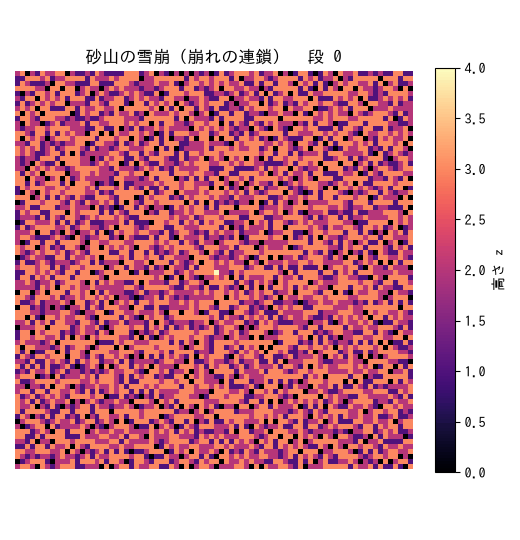

# 実験 03: 砂山モデル — 自己組織化臨界 (SOC)

**分野**: 自己組織化臨界 / **スタック**: Jupyter（重い統計計算 → 出力固定）+ GIF アニメ

Bak–Tang–Wiesenfeld 砂山モデル。1 粒ずつ砂を落とすだけで、系は**パラメータ調整なしに
臨界状態へ自己組織化**し、雪崩の大きさが**べき分布**になる。「なぜ自然界はべき則だらけ
なのか」「金融のファットテールはどこから来るのか」という問いの最小モデル。
理論は [`../../notes/self_organized_criticality.md`](../../notes/self_organized_criticality.md) を参照。

## なぜ Jupyter か

主役は「多数の雪崩を集めて分布を測る」重い統計計算。一度回して図に固定したいので
Jupyter（出力込みで保存 → GitHub でそのまま見える）が適任。実験02（marimo・対話）との
使い分け方針は [`../../lectures/notebooks_jupyter_vs_marimo.pdf`](../../lectures/notebooks_jupyter_vs_marimo.pdf) に。
加えて新しい可視化技として、雪崩の連鎖を **GIF アニメーション**にした。

## 実験条件

| 項目 | 値 |
|---|---|
| 格子サイズ $L$ | 64（統計）/ 80（GIF） |
| 崩れ閾値 $z_c$ | 4 |
| 境界条件 | 開放（系外へ散逸） |
| 駆動 | ランダムな点に 1 粒ずつ |
| 記録した雪崩数 | 約 12 万回分の駆動 |
| 乱数シード | 0（再現可能） |

## 実行方法

```bash
pip install -r ../../requirements.txt
jupyter notebook sandpile_analysis.ipynb     # 解析（出力込みで閲覧可）
python3 make_gif.py                           # 雪崩アニメ → figures/avalanche.gif
```

## 結果

### 雪崩の連鎖（アニメーション）



臨界状態の砂山に 1 粒足すと、崩れが崩れを呼んで連鎖的に広がる様子。

### べき分布：特徴的スケールの不在（本実験の主役）

雪崩サイズ $s$ の分布は $P(s)\sim s^{-\tau}$ というべき則になり、両対数で直線。
測定値 $\tau\approx1.1$（2D BTW の報告値は手法・ビン取り依存で $\approx1.0\text{–}1.3$）。
高サイズ端の折れ曲がりは有限サイズ・カットオフ。**詳細は `sandpile_analysis.ipynb`
（出力込み・GitHub 上で全図が見える）**を参照。ノートブックには以下を収録:

1. 平均高さが臨界値（$\approx2.12$）へ**自己組織化**する様子
2. 臨界状態の砂山配置（ヒートマップ）
3. 雪崩サイズ分布のべき則と指数フィット
4. 継続時間・広がりの分布（こちらもべき則）

## 構成

| ファイル | 役割 |
|---|---|
| `sandpile.py` | BTW モデル本体（numpy 並列崩れ・雪崩統計・対数ビン） |
| `sandpile_analysis.ipynb` | 解析ノートブック（出力プロット埋め込み済み） |
| `make_gif.py` | 雪崩アニメを `figures/avalanche.gif` に書き出す |

## 気づき

- **自己組織化**: 平均高さが誰の調整もなしに臨界値へ収束。負のフィードバック
  （急すぎると大雪崩で散逸、平らだと溜まる）が臨界の傾きへ系を導く。
- **べき則 = 特徴的スケールの不在**: 「典型的な雪崩の大きさ」が定義できない。
  小さな擾乱がときに系全体を巻き込む。
- 金融への含意: 大暴落に固有の引き金は要らないかもしれない——臨界状態では
  ありふれた一粒が連鎖して全体を動かしうる（市場の SOC 仮説）。
- 実験02（外から $K$ を動かして臨界を跨ぐ）と本実験（調整なしに臨界へ）の対比が、
  複雑系における臨界の二つの現れ方を示す。
